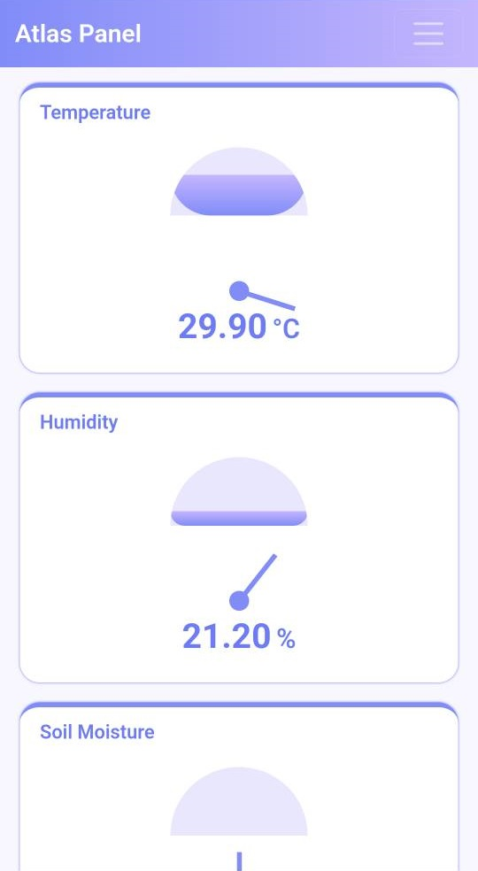
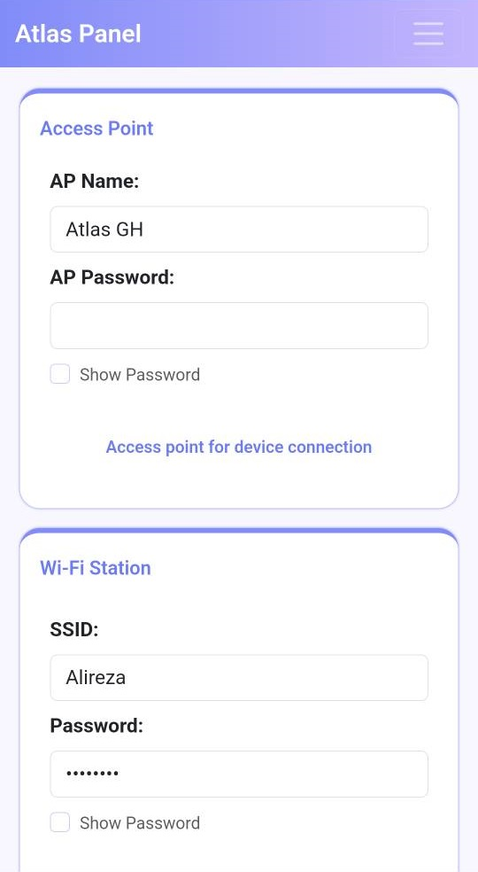

<div align="center">

  # 🌿 Atlas – Smart Greenhouse Control & Management System

  **An intelligent IoT middleware for remote monitoring, automation, and data logging of greenhouse environments using ESP32**

  
  
  
</div>


## 📸 System Preview

<div align="center">
  
  |  |  |
  |:-------------:|:-------------------:|
  |  |  |
  
</div>

## 🧠 Overview

**Atlas** is a smart greenhouse control and monitoring system built on the **ESP32** platform.  
It enables greenhouse operators to remotely monitor environmental conditions, automate device control, and record performance data for analysis and optimization.

The system acts as the central control unit, integrating sensors and relays to maintain ideal growing conditions — automatically or based on pre-defined schedules.

---

## 🌡️ Key Features

- 📶 **Remote monitoring and control** via Wi-Fi and the Internet  
- 🌡️ **Temperature & humidity sensing** for environmental management  
- 🌱 **Soil moisture monitoring** for irrigation control  
- 💡 **Light intensity measurement** using photocell  
- 🧪 **CO₂ & TVOC gas detection** for air quality analysis  
- ⚙️ **Automatic or scheduled control** of:
  - Heater  
  - Cooler  
  - Exhaust fan  
  - Fogger / humidifier  
  - Irrigation system  
  - Other connected devices  
- 📊 **Daily data logging and reporting**  
- ⏱️ **Min/max temperature & humidity tracking**  
- ⚡ **Device runtime analytics**  
- 🔒 **Secure access through a password-protected dashboard**

---

## 🧩 Hardware Requirements

| Component | Description |
|------------|-------------|
| **ESP32** | Main microcontroller board |
| **DHT22 / AM2301** | Temperature and humidity sensor |
| **Soil Moisture Sensor** | Monitors soil water content |
| **LDR / Photocell** | Measures light intensity |
| **CO₂ & TVOC Sensor** | Monitors air quality |
| **DS3231 RTC Module** | Provides accurate real-time clock for scheduling and logging |
| **Relay Module(s)** | Controls electrical devices |
| **Power Supply** | Provides stable voltage for ESP32 and peripherals |

---

## ⚙️ Installation & Setup

1. **Clone or download** this repository:
   ```bash
   git clone https://github.com/your-username/Atlas.git
   ```
2. **Open the project** in **Arduino IDE** or **PlatformIO**.  
3. **Configure the following parameters** in the source code:
   - Wi-Fi credentials (SSID & Password)  
   - Sensor pin mappings  
   - Relay connections  
4. **Upload the firmware** to your **ESP32** board.  
5. **Connect all sensors and relays** according to the wiring diagram.  
6. **Power on your module** — Atlas will start automatically.

---

## 🚀 Usage & Configuration

After powering on for the first time, Atlas creates its own **Wi-Fi Access Point (AP)**.

### 🔹 Step 1 – Connect to the Access Point
- **SSID:** `Atlas_GH`  
- **Password:** *(none — open network)*  

### 🔹 Step 2 – Access the Web Dashboard
1. Open your browser and go to:  
   👉 **http://192.168.4.1**  
2. You’ll see the **Atlas Dashboard**, showing:
   - Real-time temperature, humidity, and soil data  
   - Light intensity and gas level readings  
   - Device status indicators  

### 🔹 Step 3 – Login to Configuration Panel
To modify or configure settings:
- **Username:** `admin`  
- **Password:** `admin`  

⚠️ **Important:**  
For your security, change the default password after your first login.  
You can update it anytime from the **Settings → Security** menu.

---

## ⚙️ System Configuration Options

Inside the **Atlas Web Dashboard**, you can:
- Adjust **temperature & humidity thresholds**  
- Enable **automatic or manual control** modes  
- Define **scheduled operations** (e.g., activate fans at 8:00 AM)  
- View and download **daily environmental logs**  
- Calibrate or add new sensors  
- Monitor **runtime analytics** for each connected device  
- Manage **user credentials and permissions**

---

## 📈 Data Logging & Reports

Atlas continuously records and stores:
- Temperature & humidity variations  
- Soil moisture levels  
- Light intensity data  
- CO₂ & TVOC gas readings  
- Device operation time  

You can review logs directly from the web dashboard to:
- Analyze historical data  
- Optimize energy usage  
- Improve plant growth and performance  

---

## 🔐 Security Notes

- Default credentials (`admin / admin`) are for **first-time setup only**.  
- Always **change them immediately** after installation.  
- Keep your firmware **up-to-date** to receive new features and security patches.  
- If connected to the Internet, ensure your Wi-Fi network uses **WPA2** or higher encryption.

---

## ⚠️ Disclaimer

This version of Atlas is intended **for testing, research, and educational purposes only**.  
It is **not licensed or optimized for commercial use**, and performance or reliability in production environments is **not guaranteed**.

---

## 🧾 License

This project is licensed under the **MIT License**.  
You are free to use, modify, and distribute this software with proper credit to the author.

---

<div align="center">
  🌱 Built with ❤️ using ESP32, sensors, and smart automation —  
  for a greener, more connected future.
</div>
